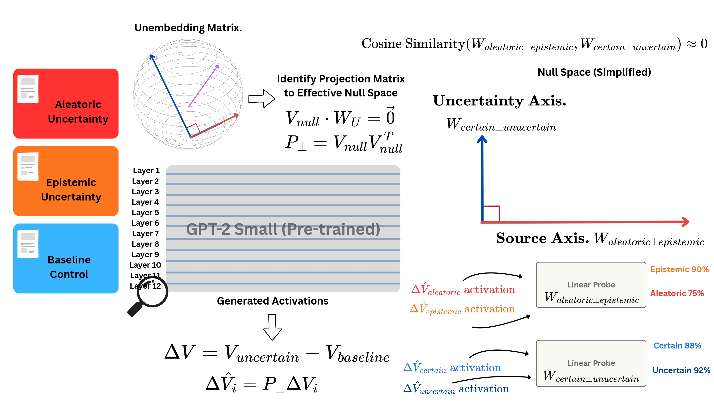

# Beyond Entropy Sinks: Structured and Disentangled Uncertainty Representations in the Unembedding Null Space

This repository contains the official codebase for the paper [Beyond Entropy Sinks: Structured and Disentangled Uncertainty Representations in the Unembedding Null Space](https://www.overleaf.com/read/kffgkndghkbz#519cf4), developed as part of the Deep Learning course under Prof. Lior Wolf at Tel Aviv University.
## Abstract

Recent mechanistic interpretability reveals that Large Language Models (LLMs) encode internal truthfulness signals independently of their logit outputs. Prior research has identified "entropy neurons" that utilize the unembedding null space to modulate confidence via LayerNorm scaling. We investigate whether this subspace functions merely as a passive "entropy sink" or whether it encodes a richer, multidimensional uncertainty structure capable of disentangling aleatoric (data ambiguity) from epistemic (model ignorance) sources.

By analyzing GPT-2 Small, Gemma-2-2B, and Llama-3.2-1B, we demonstrate that uncertainty detection and source dissociation are robustly encoded within the unembedding effective null space (ENS), maintaining functional decoupling from final logit predictions. Layer-wise geometric analysis reveals that uncertainty detection and source identification often occupy near-orthogonal axes, while specific uncertainty etiologies manifest as cohesive, task-specific directions. These findings establish the ENS as a structured, self-regulatory hub rather than a passive reservoir for residual noise. Our study identifies a mechanism for internal uncertainty monitoring, offering a potential path for future strategies to mitigate hallucinations and enhance AI safety in high-stakes deployments.



---


## Code Structure

The codebase is organized as follows:

* **`plots/`**: Contains the final figures used in the paper, including probing and geometric analysis visualizations.
* **`results/`**: Stores the raw experimental data, including extended analyses omitted from the main text for conciseness.
* **`plot_scripts/`**: Python scripts used to generate paper-ready visualizations from the raw results.
* **`src/`**: Primary source code for the experimental pipeline:
* **`config.py`**: Global configuration for switching between model families (GPT-2, Gemma-2, Llama-3) and setting hyperparameters.
* **`data/`**:
* `first_try_data.jsonl`: Initial dataset used for preliminary exploration.
* `data.jsonl`: The final curated dataset of **Minimal Triplets** (Aleatoric, Epistemic, and Baseline) used for all results in the paper.
* **`null_space_detection/`**: Implements **Singular Value Decomposition (SVD)** on row-centered unembedding matrices ($W_U$) to identify the Effective Null Space (ENS).
* **`subspace_analysis/`**: The core experimental logic.
* `main.py`: The entry point to execute the full experimental suite.
* **`requirements.txt`**: Lists all Python dependencies.

---

## Installation

The project requires Python 3.10.

```bash
# Clone the repository
git clone https://github.com/your-repo/uncertainty-sources-in-llms.git
cd uncertainty-sources-in-llms

# Set up virtual environment
python3 -m venv .venv
source .venv/bin/activate

# Install dependencies
pip install -r requirements.txt

```

### Manual Configuration Step

After running the commands above, you must manually edit **`src/config.py`** to include your specific credentials:

* **`HF_TOKEN`**: Your Hugging Face token for accessing gated models like Gemma-2 and Llama-3.
* **`MODEL_ID`**: The specific model identifier (e.g., `"google/gemma-2-2b"`).
* **`MODEL_NAME`**: The short name used for your local logging and results folders.

### Run Experiments

```bash
# Run from the root directory of the repository

# Check effective null space detection
python3 src/null_space_detection/check_effective_null_space.py

# In case of using different model than those used in the paper, make sure to update the main.py with the effective null space dimensions detected in the previous step.

# Run experiments
python3 src/subspace_analysis/main.py
```

And check the `results/` folder.